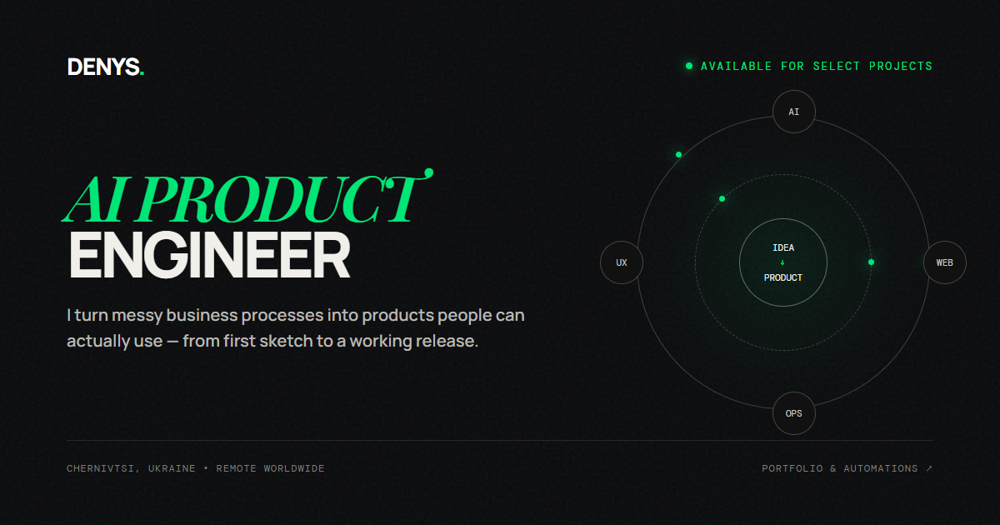

# Denys Yefimenko — AI Product Engineer

I turn manual business bottlenecks and messy operational workflows into focused, working digital products — from first sketch to practical release.

My work centers on practical AI workflows, business process automations, Telegram bots, booking systems, and rapid product prototypes. Before writing software, I spent over three years inside an EdTech company working across LMS operations, CRM integrations, feedback loops, and operational pipelines — an experience that shaped my builder philosophy: understand the actual process first, then choose the smallest technology stack that genuinely solves it.

---

## Selected Work

### 01. HoReCaFam
* **Status:** In development
* **Description:** Staff training platform for restaurants and coffee shops featuring invite-based onboarding, structured knowledge practice, interactive exams, progress tracking, and catalogue import.
* **Stack:** React, Python, PostgreSQL, Railway

### 02. STRATA / Bearka
* **Status:** In development
* **Description:** A premium e-commerce catalogue experience for a multi-store footwear business. Designed around a supplier catalogue of approximately 5,477 products with refined category filters, search, and variants.
* **Stack:** React, TypeScript, E-commerce, Integrations
* **Live Demo:** [View demo](https://strata-ecommerce-demo-production.up.railway.app/)

### 03. DZHERO
* **Status:** In development / prototype
* **Description:** AI-powered short-form content system that analyzes brand sources, identifies viral video signals, generates structured scripts, and prepares weekly content plans.
* **Stack:** LLM APIs, RAG, Python, React
* **Prototype:** [View prototype](https://frontend-staging-c899.up.railway.app/)

### 04. Booking Automation
* **Status:** Live demo
* **Description:** Direct-booking website and lightweight CRM for vacation-rental owners, featuring property-aware date selection, transparent pricing logic, and a streamlined guest checkout flow.
* **Stack:** React, Multi-tenant, CRM, Railway
* **Live Demo:** [View demo](https://booking-demo-production.up.railway.app/)

### 05. Mama Prybrala
* **Status:** Launched
* **Description:** Telegram ordering automation and operational sync for a cleaning service: instant pricing calculation, lead intake, booking validation, admin notifications, and live Google Sheets CRM synchronization.
* **Stack:** Python, Aiogram, Google Sheets, PostgreSQL

### 06. AccessFlow
* **Status:** Launched
* **Description:** Automated payment verification and membership management system for private Telegram communities, including subscription renewals, expiration handling, and one-time invite link generation.
* **Stack:** Python, FastAPI, Payments, Telegram

---

## Technical Foundation

The portfolio website is intentionally built without heavy frameworks or build runtimes:

* **Semantic HTML5:** Clean structure, meaningful landmarks, accessible labels, and zero nested links.
* **Vanilla CSS:** Dark-editorial design system, fluid typography (`clamp()`), and responsive layouts without CSS frameworks.
* **Vanilla JavaScript:** Zero runtime dependencies; lightweight scroll, reveal, and filtering interactions.
* **Accessibility & Focus:** Full keyboard navigation via Tab, clear `:focus-visible` states, and minimum 44px mobile touch targets.
* **Motion Budget:** Motion is limited to a small set of interactive and decorative elements, with full support for prefers-reduced-motion.
* **Asset Optimization:** Next-generation WebP images (~89.5% weight reduction) with explicit dimensions that help prevent image-induced layout shifts and native `loading="lazy"`.
* **Self-Hosted Typography:** Fonts (DM Mono, Manrope, Playfair Display) are served locally as optimized WOFF2 files with zero runtime requests to third-party CDNs; OFL license files are stored in `dist/assets/fonts/licenses/`.

---

## Run Locally

To run the site locally without build tooling:

```powershell
python -m http.server 8080 --directory dist
```

Then open your browser at:

```text
http://localhost:8080
```

---

## Project Structure

```text
.
├── .editorconfig
├── .gitignore
├── AGENTS.md
├── README.md
├── SECURITY.md
├── .harness/
│   ├── CONTEXT.md
│   ├── START-HERE.md
│   ├── STATUS.md
│   └── commands.md
└── dist/
    ├── _headers
    ├── app.js
    ├── index.html
    ├── styles.css
    └── assets/
        ├── favicon.svg
        ├── og-cover.png
        ├── fonts/
        │   ├── dm-mono-300-latin.woff2
        │   ├── dm-mono-400-latin.woff2
        │   ├── dm-mono-500-latin.woff2
        │   ├── manrope-variable-latin.woff2
        │   ├── playfair-display-italic-600-latin.woff2
        │   └── licenses/
        │       ├── DM-Mono-OFL.txt
        │       ├── Manrope-OFL.txt
        │       └── Playfair-Display-OFL.txt
        └── projects/
            ├── accessflow-bot.webp
            ├── accessflow-checkout.webp
            ├── booking-flow.webp
            ├── dzhero-product.webp
            ├── mama-prybrala-dashboard.webp
            ├── mama-prybrala-flow.webp
            └── strata-catalog.webp
```

---

## Quality and Privacy

* **Sanitized Materials:** Current and reachable historical public assets are sanitized to remove visible personal, customer, payment, and credential data (including phone numbers and photographic avatars) while preserving product context.
* **Local Reference Isolation:** Internal research files (`Ref/`) and review screenshots (`Review/`) remain local and are excluded from Git tracking via `.gitignore`.
* **Zero Production Credentials:** No API keys, credentials, backend secrets, or personal emails are committed.
* **Pre-deploy Verification:** A preliminary repository privacy and secret scan has passed. An independent Codex security re-audit remains required following remediation, and deployment has not yet been performed.

---

## Contact

* **Telegram:** [t.me/PackChoOi](https://t.me/PackChoOi)
* **GitHub:** [github.com/GarnikSacsha](https://github.com/GarnikSacsha)
* **LinkedIn:** [linkedin.com/in/denys-yefimenko](https://www.linkedin.com/in/denys-yefimenko/?locale=en)

---

© 2026 Denys Yefimenko
